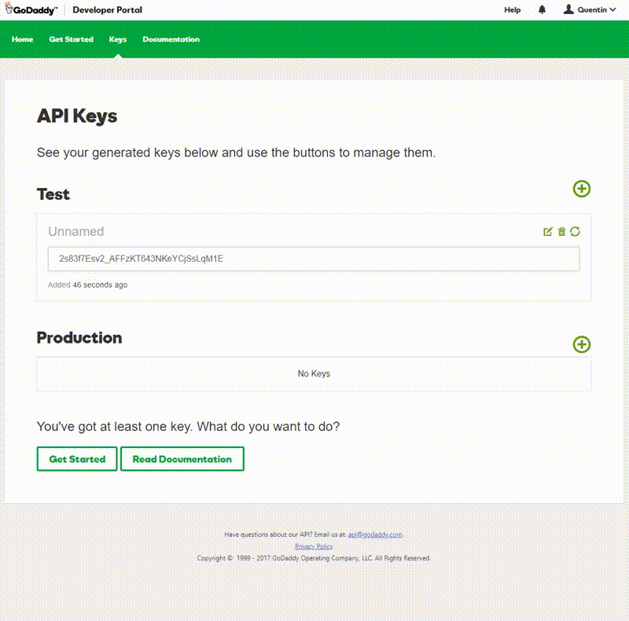
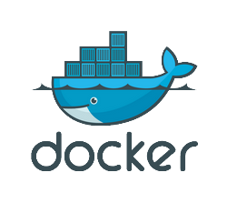

# GoDaddy DDNS Public IP updater

Update the IP address of your A record of your *GoDaddy* domain every 5 minutes.

It relies on the GoDaddy API and only uses bash, making it small with low resource requirements.
The image is **10MB** and requires **156KB** of RAM when idle and **2MB** of RAM at boot time.

## Installation

### GoDaddy credentials

[](https://godaddy.com)

1. Login to [https://developer.godaddy.com/keys](https://developer.godaddy.com/keys/) with your account credentials.

[](https://developer.godaddy.com/keys)

2. Generate a Test key and secret.

[](https://developer.godaddy.com/keys)

3. Generate a **Production** key and secret.

[](https://developer.godaddy.com/keys)

Obtain the **key** and **secret** of that production key.

In this example, the key is `dLP4WKz5PdkS_GuUDNigHcLQFpw4CWNwAQ5` and the secret is `GuUFdVFj8nJ1M79RtdwmkZ`.

### Option 1 of 2: Docker container

[](https://www.docker.com/)

1. Make sure you have [Docker](https://docs.docker.com/install/) installed
2. Obtaining the Docker image
    - Option 1 of 2: Docker Hub Registry
        1. You can check my [Docker Hub page](https://hub.docker.com/r/qmcgaw/godaddy-ip-ddns/) for more information.
        2. In a terminal, download the image (10MB) with:
            ```bash
            sudo docker pull qmcgaw/godaddy-ip-ddns
            ```
    - Option 2 of 2: Build the image
        1. Download the repository files or `git clone` them
        2. With a terminal, go in the directory where the *Dockerfile* is located
        3. Build the image with:
            ```bash
            sudo docker build -t godaddy-ip-ddns ./
            ```
3. Launching the Docker container from the image (replace the values below):
    ```bash
    sudo docker run -d --name=godaddyddns --restart=always -e 'DOMAIN=mydomain.com' -e 'KEY=dLP4WKz5PdkS_GuUDNigHcLQFpw4CWNwAQ5' -e 'SECRET=GuUFdVFj8nJ1M79RtdwmkZ' -e 'NAME=@' godaddy-ip-ddns
    ```

Note that we set the following container environment variables with the flag `-e`:
| **Environement variable** | **Value** | *Optional* |
| ------------- |:-------------:| -----:|
| DOMAIN      | Domain name | No |
| KEY      | Production key's key | No |
| SECRET | Production key's secret | No |
| NAME | @      | **Yes**, defaults to `@` |

You can also run the container interactively to test it with:
```bash
sudo docker run --rm --name=godaddyddnsTEST -e 'DOMAIN=mydomain.com' -e 'KEY=dLP4WKz5PdkS_GuUDNigHcLQFpw4CWNwAQ5' -e 'SECRET=GuUFdVFj8nJ1M79RtdwmkZ' -e 'NAME=@' godaddy-ip-ddns
```

### Option 2 of 2: using the Shell script godaddyddns.sh

1. Set the necessary variables:
    - Option 1 of 2: Set environment variables:
    ```bash
    DOMAIN=mydomain.com
    KEY=dLP4WKz5PdkS_GuUDNigHcLQFpw4CWNwAQ5
    SECRET=GuUFdVFj8nJ1M79RtdwmkZ
    NAME=@ # optional
    ```
    - Option 2 of 2: Set variables in the shell script *godaddyddns.sh*
        1. Copy the following block of code:
        ```shell
        DOMAIN=mydomain.com
        KEY=dLP4WKz5PdkS_GuUDNigHcLQFpw4CWNwAQ5
        SECRET=GuUFdVFj8nJ1M79RtdwmkZ
        ```
        2. Paste it just after the first line `#!/bin/bash`
2. Make the script executable with:
```bash
sudo chmod +x godaddyddns.sh
```
3. Test the script by running it once with:
```bash
./godaddyddns.sh
```
Check your IP address in the A record on GoDaddy has been updated successfully.
4. Setup a Cron job so that the script is executed periodically. See [this](https://awc.com.my/uploadnew/5ffbd639c5e6eccea359cb1453a02bed_Setting%20Up%20Cron%20Job%20Using%20crontab.pdf) for more information.


Launch the Docker container with

```bash
sudo docker run -d --name=godaddyddns --restart=always -e 'KEY=yourGoDaddyKey' -e 'SECRET=yourGoDaddySecret' -e 'DOMAIN=yourdomain.com' godaddyddns
```